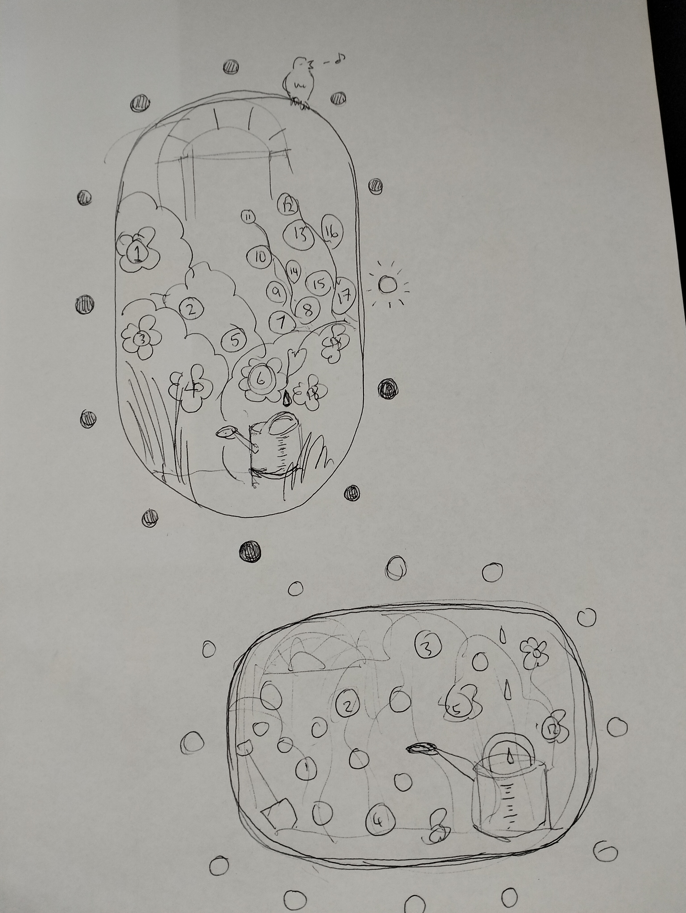
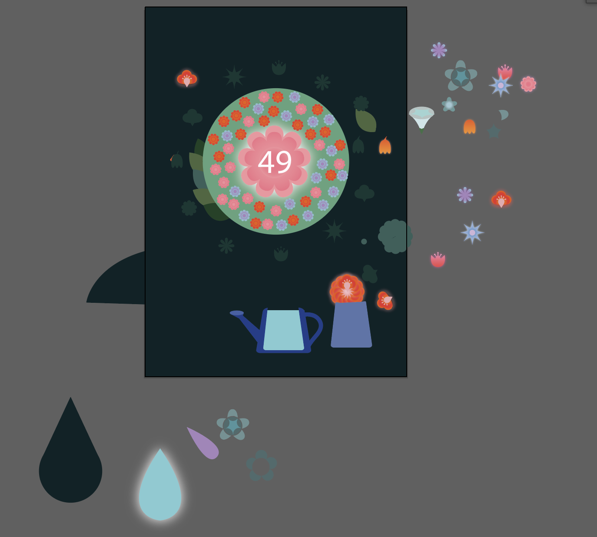

# MDDN 242 Project 1: Time-based Media  
## Garden Clock by Eri Lovegrove
### Design intentions

The Garden Clock was created with the intention of being both functional and aesthetically pleasing. I aimed to design a clock that not only tells time but is pretty to look at. The key features include glowing flowers to indicate the hour, a central number display for minutes, and a watering can that fills up to represent the seconds.

### External Influence and Inspiration
My main source of inspiration for this project came from a Pinterest board featuring garden-themed images (https://www.pinterest.nz/toothmushroom/garden/). The colours, vibes, and tones of these images influenced my design choices. I color-picked shades I liked from these images and incorporated similar floral designs into my clock.

### Design Process
I began by familiarizing myself with coding techniques using the Maeda clock imitation. This helped me get back into the coding flow and challenged me to use new functions.

Starting with a sketch, I refined my design as I gained a better understanding of the assignment. 

Once comfortable, I translated my sketch into basic code foundations.

Experimenting with Illustrator, I created visuals for my clock, focusing particularly on crafting the flowers. This part of the process was enjoyable as it allowed me to bring my design to life.

Finally, I incorporated an alarm feature into the clock, which causes the flowers to blink when activated.

This iterative process involved coding, sketching, visual design, and functionality testing, resulting in a clock that achieves both its functional and aesthetic goals.