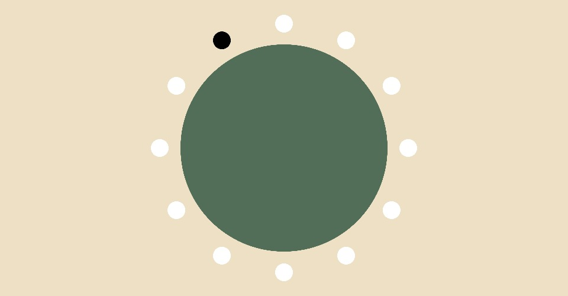

## MDDN 242 Project 1: Time-based Media  

### 28/2/24
I created a sketch of a window sill garden themed clock. On the left, a flower will grow a little bit every second, in the middle a watering can will fill up every minute, and on the right, a vine will bloom every hour. 

Garden Clock by Eri Lovegrove

influences
design process 

### 2/3/24
Maeda clock imitation: I really challenged myself to make this clock work, and used new functions that i've never used before to sort the numbers into rows and columns. 

### 5/3/24

I slightly adjusted my design to show time differently. The hours will be indicated by the 12 circles around the bigger circle. There will be numbers 0 - 59 placed on 59 flowers, where one will be highlighted depending on the minute. The seconds will be shown by the water rising in the watering can, and a water drop that will be dropping every second. I started doing some very basic coding.

### 7/3/24
I did some basic coding to make 12 circles around the bigger circle, where one would light up depending on the hour. I used maps and angles to make the time AM and PM. 

### 12/3/24
With some help, I have started to code numbers 0-59 that will keep track of the minutes. Nothing pretty at the moment, still getting a feel for the code. On the right, a dark green circle falls smoothly every second into a blue rectangle that increases every second. This will be the base for my watering can idea. 

Garden Clock by Eri Lovegrove
Design Intentions
The Garden Clock was created with the intention of being both functional and aesthetically pleasing. I aimed to design a clock that not only tells time but also serves as a visually captivating piece of decor. The key features include glowing flowers to indicate the hour, a central number display for minutes, and a watering can motif that fills up to represent the seconds.

External Influence and Inspiration
My main source of inspiration for this project came from a Pinterest board featuring garden-themed images (https://www.pinterest.nz/toothmushroom/garden/). The colors, vibes, and tones of these images influenced my design choices. I color-picked shades I liked from these images and incorporated similar floral designs into my clock.

Design Process
I began by familiarizing myself with coding techniques using the Maeda clock imitation as a reference point. This helped me get back into the coding flow and challenged me to utilize new functions.

Starting with a sketch, I refined my design as I gained a better understanding of the assignment. Once comfortable, I translated my sketch into basic code foundations.

Experimenting with Illustrator, I created visuals for my clock, focusing particularly on crafting the flowers. This part of the process was enjoyable as it allowed me to bring my design to life visually.

Finally, I incorporated an alarm feature into the clock, which causes the flowers to blink when activated.

This iterative process involved coding, sketching, visual design, and functionality testing, resulting in a clock that achieves both its functional and aesthetic goals.